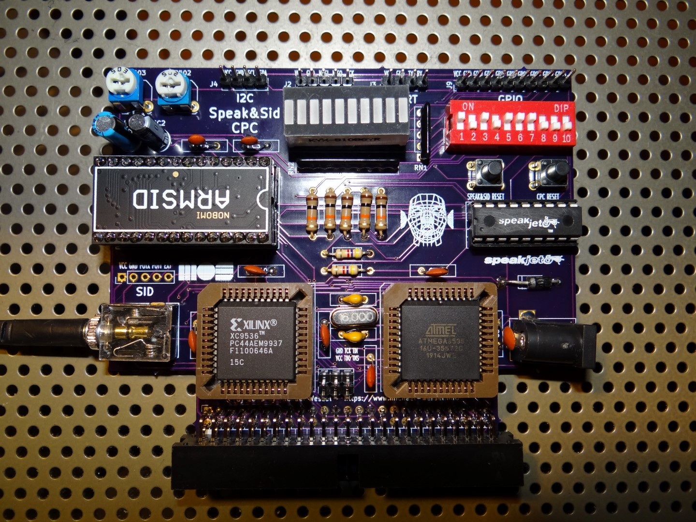
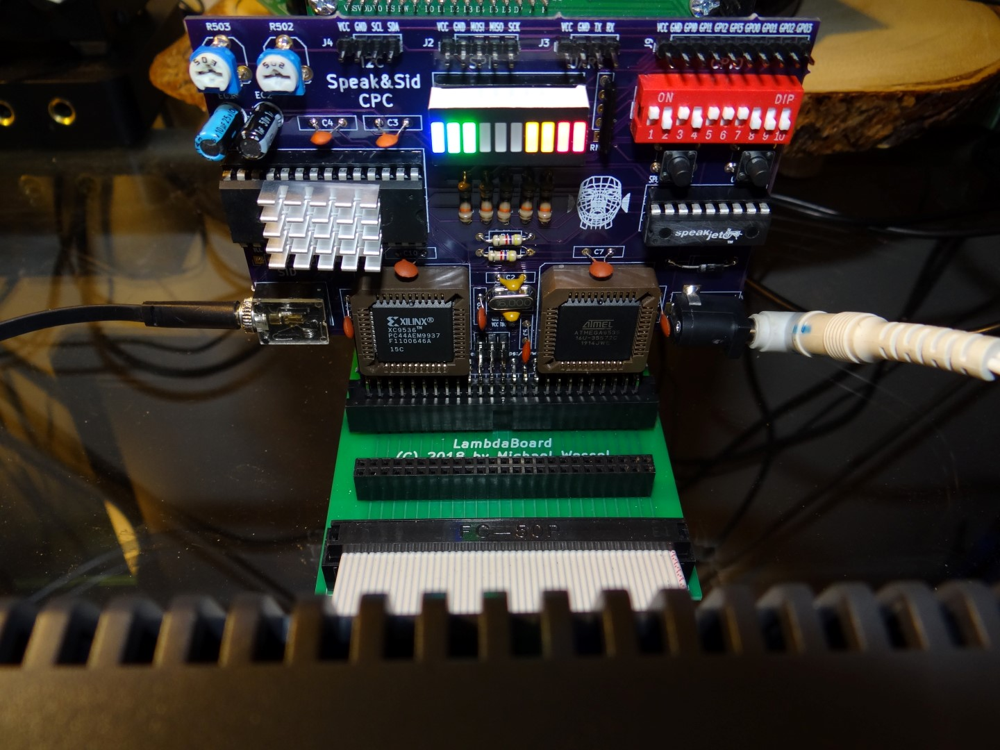
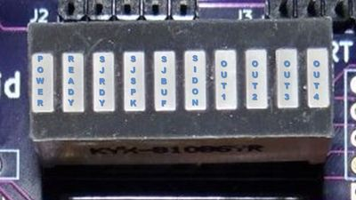
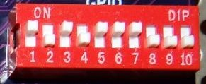

# Speak & SID CPC 

A Speech Synthesizer and SID Soundcard for the Amstrad CPC 

Speak&SID plugs into the expansion port of the CPC, and is a M4-compatible expansion card. A cable or a CPC expansion board backplane (such as the Mother4X or the **LambdaBoard**) is recommended, and in fact required in case more than one expansion card is being used. Else, a simple 50pin IDC ribbon cable will do as well. 

This CPC expansion board offers:

1. A SpeakJet-based speech synthesizer, featuring a native SpeakJet-based mode as well as a SpeakJet-based emulation of the classic Amstrad SSA-1 speech synthesizer from 1985. 
2. A sound synthesizer utilizing  the fabolous SID (Commodore 64) soundchip. Speak&SID CPC can use the original **6581**, the **8580**, as well as modern re-implementations of the SID chip such as **SwinSID** or **ARMSID**. To use the 6581, supply **12 V with positive center polarity** over the Speak&SID power barrel jack using a stabilized low noise (preferably linear) DC power supply; for the **8580**, **9 V** are required. **No extra PSU** is needed for **SwinSID** or **ARMSID**. 
3. A general purpose multi-IO expansion, featuring a **Serial Interface (UART)**, a **SPI Interface**, an **I2C Interface**, as well as **4 digitial general purpose input/output ports (GPIOs)**. The 4 rightmost LEDs of the LED Segment Bar shows the status of the 4 GPIO outputs. Notice that Speak&SID supplies pin headers for GPIO, UART, SPI, and I2C. 

Firmware updates to the CPLD can be acomplished "in system" by using the JTAG header; the ATMega microcontroller can be updated with a ISP USB programmer such as USBtinyISP connecting to the SPI headers via Dupoint cables.  

## Some Pictures 

  
  

## Some YouTube Videos 

- [Second SID Player Demo - Line Out Recording and LED Lightshow](https://youtu.be/FXDS3pdf-w8) 
- [First PCB Version \& SID Player Demo](https://youtu.be/xVo5ycUuM5Q)
- [Breadboard Prototype - First SID BASIC Test](https://youtu.be/dJlccupSALY) 
- [Breadboard Prototype - Amstrad SSA-1 Emulation Test](https://youtu.be/zLsgOHT1fmA)

## License

GPL 3 

## Speak&SID Hardware Overview 

The **main components** are: 

- Microcontroller: ATMega 8535 @ 16 MHz. Role: Brain of Speak&SID. Controls the SpeakSet, UART, SPI, I2C, GPIO, and implements the Amstrad SSA-1 emulation.
- CPLD: Xilinx 9536. Role: Address decoding, SID control and 1 MHz clock, glue logic functions. 
- Speech chip: SpeakJet. Role: speech synthesis and sound synthesizer. 
- Sound chip: SID 6581 or 8580, SwinSID, or ARMSID, or..... Role: sound chip for awesome SID tunes! 

The source code for the CPLD and the ATMega are provided here (and HEX / JED firmware files as well). 

CPC Speak&SID has **two reset buttons**: one for resetting the Speak&SID, and one for resetting the CPC. 

CPC Speak&SID has **two trimmer / potentiometers**; the left potentiometer
controls the volume / signal level of the SpeakJet chip, the other one
controls the SID volume level. The signal stereo routing is determined
by the 10 DIP switches, see below.

The sound comes out of the **audio stereo jack**. The left/right channel can be assigned individually (SpeakJet / SID). 
Also, a switch determines whether the determined left or right channel audio is fed back into the CPC to be heard
in the internal CPC speaker. 

The optional **power barrel jack** need center polarity, and either 12 V (SID 6581) or 9 V (SID 8580). 

The **LED Segment Bar** visualizes the status / state of Speak&SID, see below. 

Note that both the SpeakJet as well as the SID are mono audio output devices, but the can be assigned to the left and/or right channel of the stereo output signal using the **DIP Switches**. Do not assign both SID and SpeakJet output to one single (left or right) audio channel; use different channels. In case you would like to hear the SID (or SpeakJet) on both channels (left and right), make sure to deselect the SpeakJet (SID, respectively) first, using the DIP switches. See below. 

## Requirements 

This project was developed using
[WinAVR.](http://winavr.sourceforge.net/) In addition, the [AVR
Programming Libraries](https://github.com/hexagon5un/AVR-Programming)
from Elliot Williams' book "Make: AVR Programming" are being used. A
copy of the library is also included in the [src folder of this
project.](src/atmega8535/)

## Building and Maker Support 

I am able to provide Speak&SID as a kit, or only pre-programmed components (CPLD, ATMega), or even a fully assembled version inlcuding
a connection cable and/or LambdaBoard expansion board backplane. Send me a mail if you are interrested. Or, just download the sources and build it from the [provided Gerbers](gerbers/speak&sid.zip) and [BOM](schematics/bom.jpg). 

To build the [firmware from source,](src/atmega8535/speaksid/speaksid.c) use `make` and the [provided `Makefile`.](src/atmega8535/speaksid/Makefile). 

template is again from Elliot Williams' book. See above. 

## Status LEDs 

- **POWER**: Obvious
- **READY**: Lights up when Speak&SID is waiting for / expecting input from port `&FBEE`. 
- **SJRDY**: Lights up when SpeakJet is ready. See [SpeakJet manual](manuals/speakjet-usermanual.pdf) for details. 
- **SJSPK**: Lights up when SpeakJet is speaking. See [SpeakJet manual](manuals/speakjet-usermanual.pdf) for details. 
- **SJBUF**: Lights up when SpeakJet's input buffer is half full. See [SpeakJet manual](manuals/speakjet-usermanual.pdf) for details. 
- **SIDON**: Lights up then Speak&SID is in SID mode. 
- **OUT1, OUT2, OUT3, OUT4**: Status of Speak&SID's general purpose output (GPO) pins. 

## DIP Switches

- **1**: Assign SpeakJet output to left channel. Don't turn on if **2** is on!
- **2**: Assign SID output to left channel. Don't turn on if **1** is on! 
- **3**: Route left channel to CPC internal speaker. 
- **4**: Assign SpeakJet output to right channel. Don't turn on if **5** is on! 
- **5**: Assign SID output to right channel. Don't turn on if **4** is on! 
- **6**: Route right channel to CPC internal speaker. 
- **7**: Assign ATMega TX UART output to SpeakJet RX input. Required for SpeakJet operation. Don't turn on if **8** is on! 
- **8**: Assign GND to Speakjet RX input. Required if Serial / UART Mode is being used. Don't turn on if **7** is on!
- **9**: Enable 4.7 kOhm SDA VCC pull-up resistor. Used for I2C. Optional. 
- **10**: Enable 4.7 kOhm SCL VCC pull-up resistor. Used for I2C. Optional.   

## Firmware Update / Flash 

The firmware can be updated without having to remove the ATMega uC from the socket. The SPI header pins of Speak&SID can be used for updating the firmware. 

I am using the USBtinyISP programmer. Just connect the progammer's SPI pins with the corresponding Speak&SID SPI pins, using DuPont cables: MOSI <-> MOSI, MISO <-> MISO, SCK <-> SCK, and GND <-> GND. Note that VCC might not be required. If your connecting to VCC, make sure to FIRST power on the CPC and Speak&SID BEFORE plugging in the USB cable into your computer, otherwise the USB port is powering the CPC. VCC should not be required for programming. With the proper connections in place and the CPC and Speak&SID up and running, use the provided `make flash` (entered into a `command.com` shell) from the `Makefile` **whilst holding the Speak&SID Reset button pushed down until the programming process has finished.** The firmware HEX file is small, so it only takes about 20 seconds to programm the firmware. 

## Firmware Documentation 

The best documentation is the [ATMega source code itself.](src/atmega8535/speaksid/speaksid.c) 

Speak&SID main IO port is `&FBEE`. This is the port that is / was being used by the Amstrad SSA-1 speech synthesizer. 

In the following, a **control byte** or **command** is a sequence of at least 2 bytes starting with `255`. For example, to reset Speak&SID, send control byte `0`, i.e., send the sequence `255, 0`. The different modes of Speak&SID are entered by sending various control bytes. Note that, in order to send 255 as `payload` data, it needs to be escaped, otherwise it would be interpreted as starting a control byte. Hence, send `255, 255` to send `255` as payload data. 

In the following, the control bytes for setting the corresponding Speak&SID modes are listed: 

- **Native SpeakJet Mode**: 2 (hence, send `255, 2` to enter this mode). If this mode is active,  every byte being sent to `&FBEE` will be handed over to the SpeakJet chip directly. Again, note that in order to send byte 255, you will need to send 255 twice.  In this mode, the current status of the SpeakJet chip will be visible on the corresponding Segment Bar LEDs (SJRDY, SJSPK, SJBUF), and the signals will also be available to read from port `&FBDE`. The lower three bits on `&FBDE` correspond to SpeakJet Ready (D0 = SJRDY LED), Speakjet Speaking (D1 = SJSPK LED), and SpeakJet Buffer Half Full (D3 = SJBUF LED). 

The current SpeakJet voice can be changed / altered in a number of ways, including pitch, speed, volume, etc. Use the following control bytes: change volume (`20, <value>`), speed of speech (`21, <value>`), pitch (`22, <value>`), and "bend" (`23, <value>`). Once changed, the voice can always be tested using control byte / command `10` (test voice). Notice that the same voice is used for the SSA-1 mode (see next). 

- **Amstrad SSA-1 Emulation Mode**: 3. In this mode the Amstrad SSA-1 speech synthesizer is emulated. On port `&FBEE`, emulated SBY and LRQ SP0256-AL2 signals are visible, such that existing CPC software will think that an Amstrad SSA-1 is present. The emulation has been tested with SSA-1 supporting speech games such as "Roland in Space", the SSA-1 driver software, "Tubaruba", and others. 

- **SID Mode**: 4. In this mode, the SID soundchip is turned on. The 28 SID registers of the SID soundchip are mapped to the CPC's IO range `&FAC0 - &FADC`. In addition, in this mode, Speak&SID is listening to `&FBEE` - any output to `&FBEE` will be output to the GPIO ports, hence setting the coresponding LED pattern on the LED Segment Bar. This can be used for programming lightshows, or volume level meters, etc. In order to **quit the SID mode**, send 255 to `&FBEE`. Notice that the GPIO is 4bit only, so only values 0-15 make a difference wrt. LED patterns (only the lower nibble of the byte). Notice that all IO requests in the `&FAC0 - &FADC` range directly go to the SID chip as long as the SID mode is enabled, hence resulting in maximal SID access speed (no ATMega involvement for SID access). 

- **UART / Serial Mode**: 5. Enables the UART. One the UART mode is enabled, every byte received on port `&FBEE` will directly be transmitted over TX, using the current UART settings for baud rate, parity, number of stop bits, and word width. See table below. BAUD rates above MIDI (312500) have not been tested. 

The incoming RX messages are buffered via interrupts at all time as soon as the UART mode is enabled, and the so-far received buffer content and number of bytes in the buffer can be requested and retrieved at any time via a number of UART commands. 

A number of control byte / commands determines the UART TX settings. These commands are: 

--------------------------------------------------------------------------------------------------------------
| Command        | Command Byte | Command Argument Byte. Bold = default  | Explanation                       |
|----------------|--------------|----------------------------------------|------------------------------------
| Set Baud Rate  |      50      |  BAUDRATE, **9600** default            | See table below for baud rates    |
| Set Data Width |      51      |  5, 6, 7, **8**                        | 5 to 8 bits word width            |           
| Set Parity     |      52      |  **0 (no)**, 1 (odd), 2 (even)         | No parity, odd or even parity     | 
| Set Stop Bits  |      53      |  **1**, 2                              | One or two stop bits              | 
--------------------------------------------------------------------------------------------------------------

The BAUD rates are: 

-----------------------------
| BAUDRATE | BAUDS          |
|----------|----------------|
|     0    | 2400           |
|     1    | 4800           |
|     2    | 9600 (DEFAULT) | 
|     3    | 14400          |
|     4    | 19200          | 
|     5    | 28800          |
|     6    | 31250          | 
|     7    | 38400          |
|     8    | 57600          | 
|     9    | 76800          | 
|    10    | 115200         |
|    11    | 208333         | 
|    12    | 250000         |
|    13    | 312500 (MIDI)  | 
|    14    | 416667         |
|    15    | 625000         | 
|    16    | 1250000        | 
-----------------------------

- **SPI Mode**: 6. Not implemented yet. In the meantime, patch / extend the firmware for your own SPI device yourself! Programming / flashing the ATMega over the SPI headers works, see below. 

- **I2C Mode**: 7. Not implemented yet. In the meantime, patch / extend the firmware for your own I2C device yourself! 

- **GPIO Mode**: 8. Simple. The lower nibble of each byte sent to `&FBEE` (IOREQ WRITE) will be output to the 4 GPOs 1 to 4, and visalized on the LED Segment Bar. The current status of the 4 GPIs 1 to 4 can be read from `&FBEE` (IOREQ READ) at any tmie in that mode. 

- **Echo Test Mode**: 9. For testing the communication between the CPC and Speak&SID. In this mode, each byte sent (IOREQ WRITE) to port `&FBEE` is immediately echoed back and output on port `&FBEE` such that the next IOREQ READ will read the same value as just sent. 

The following commands / control bytes do not correspond to modes, i.e., the do not change the current mode, but are also prefixed with `255`: 

- **Speak&SID Reset**: 0. 

- **SpeakJet Reset**: 1. 

- **Get Mode**: 30. Return the current mode. Read it from `&FBEE`. 

- **Get Version**: 99. Return the current version number. Read it from `&FBEE`. 

- **Wait 5 Seconds**: 100. For testing pruposes. 

- **ESCAPE 255**: 255. To send `255` as payload, send `255, 255`.  

## CPC Disk - Software 

Currently, the [Speak&SID CPC DSK](cpc/speakandsid/SPEAKSID.dsk) contains a demo program, a SID player with LED Lightshow, and a demo of the Serial Interface / UART - a simple terminal program written in BASIC. Some SID tunes are on the DSK as well. 

## Acknowledgements

- Elliot Wiliams for his book "Make: AVR Programming" and [corresponding sources /AVR Programming Libraries.](https://github.com/hexagon5un/AVR-Programming) 

- [DaDMaN from the CPC Wiki Forum](http://www.cpcwiki.eu/forum/amstrad-cpc-hardware/new-amstrad-cpc-sound-board-(aka-sonique-sound-board)-sid-part-(wip)/) for providing the Z80 source code of his branch of Simon Owen's Z80 SID Player.

- [Simon Owen](https://simonowen.com/sam/sidplay/) for the [Z80 SID Player.](https://github.com/simonowen/sidplay)

Previous SID hardware soundcards for the CPC exist. The earliest one was featured in the [CPC International 8/1989 Issue.](https://archive.org/details/54_Amstrad_PC_International_1989-08).  
Other attemps of connecting a SID to the CPC are documented on the CPC Wiki Forum. The hardware design of Speak&SID differs in major aspects from all of these, and is not related to any previous designs. 

