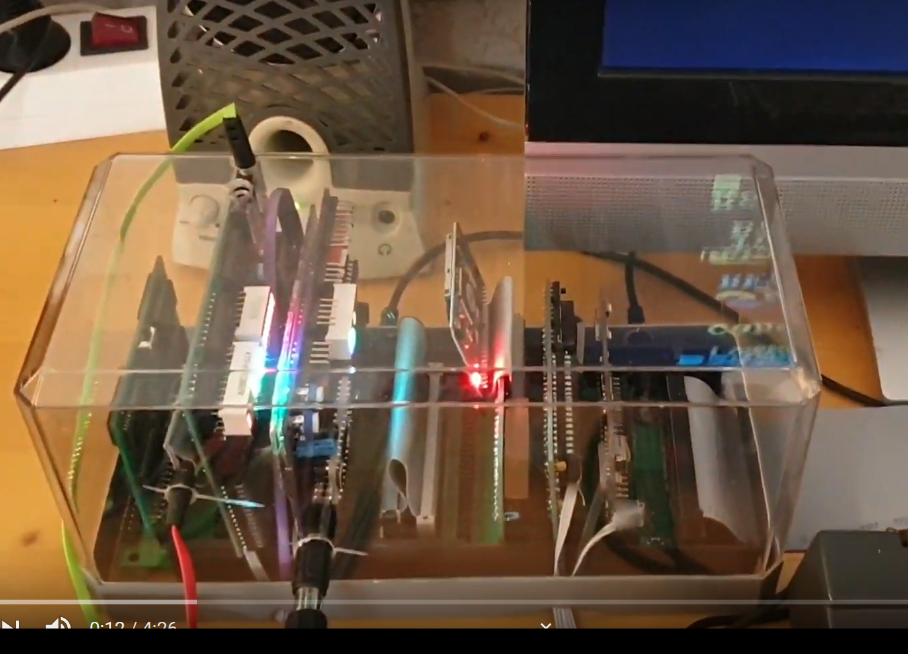
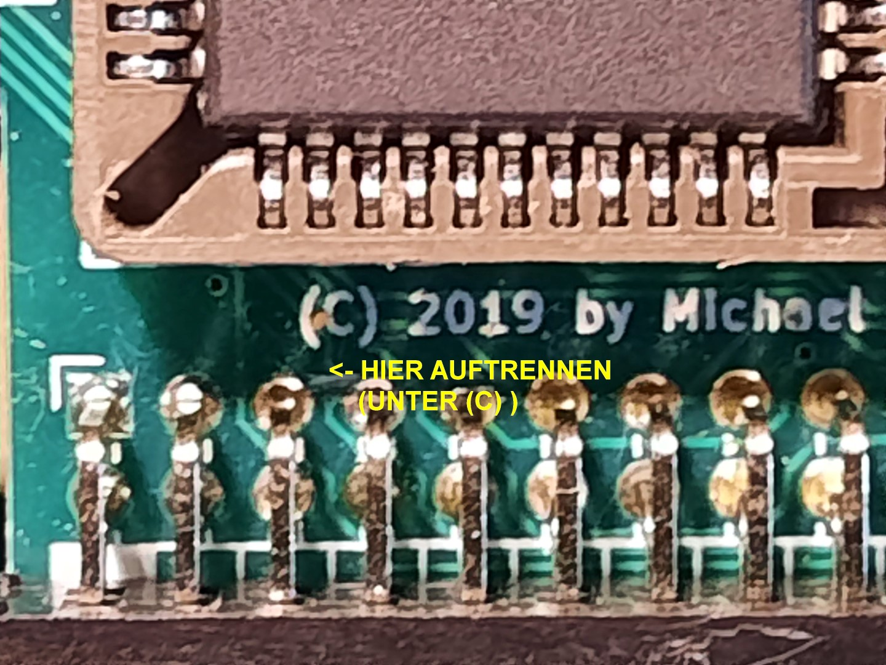
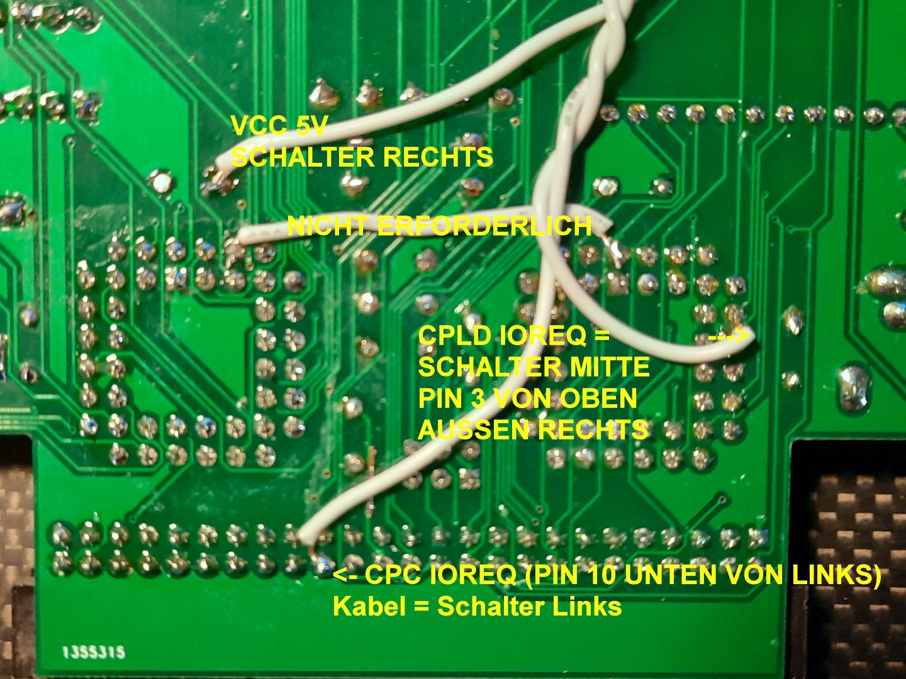
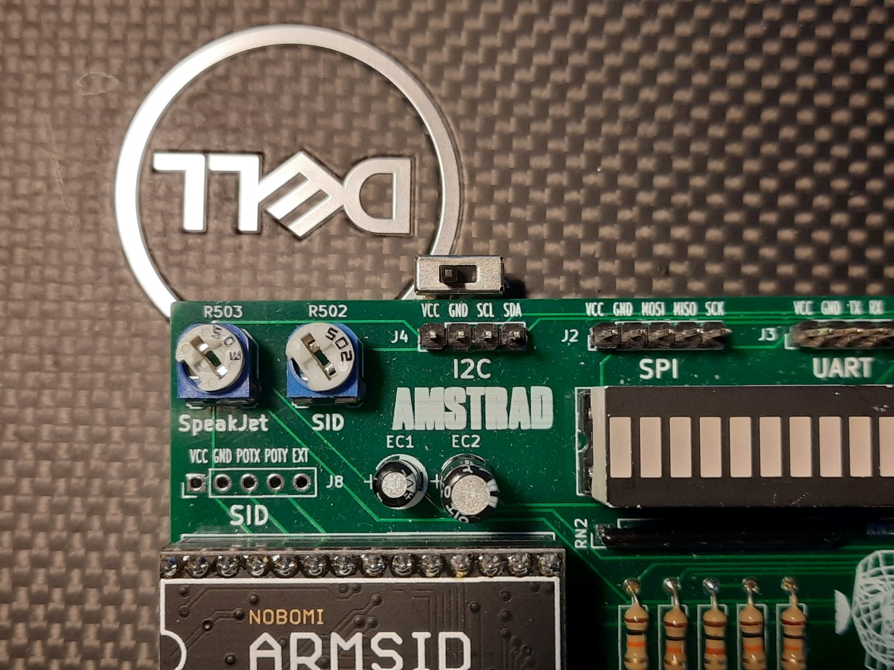
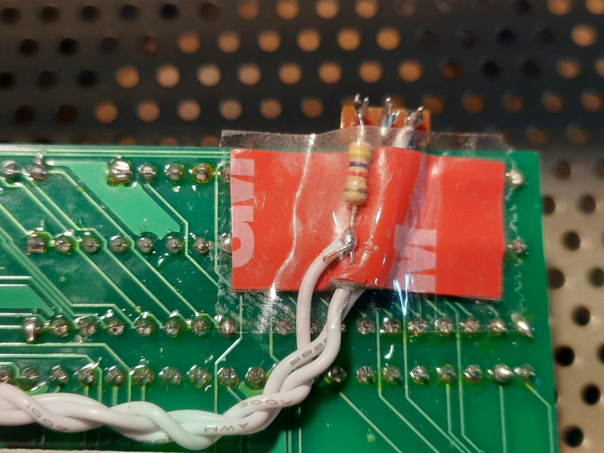
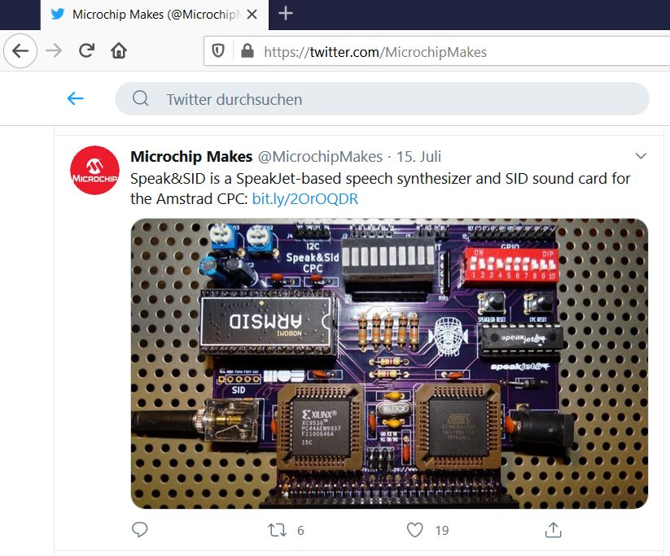
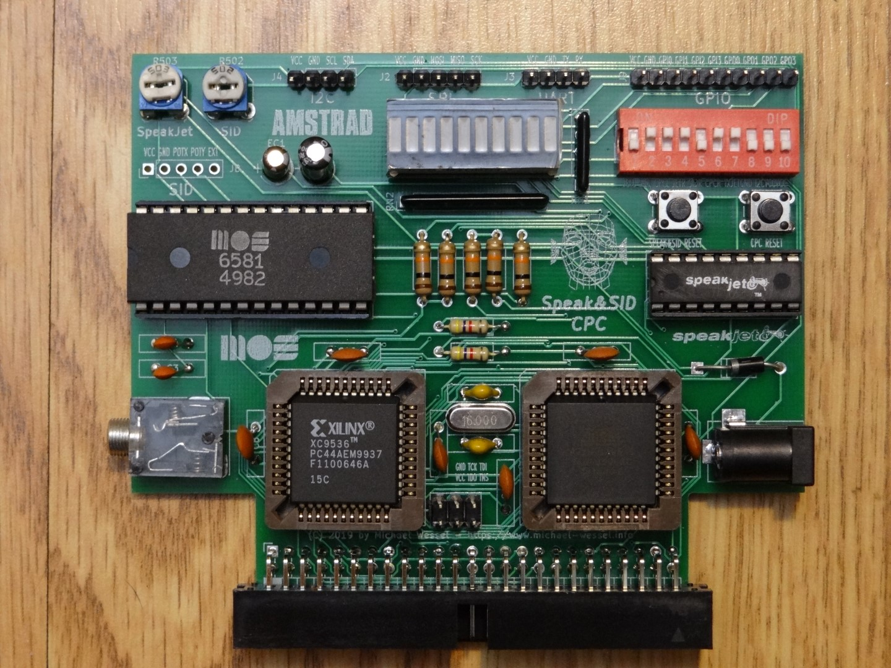

# Speak & SID CPC 

A Speech Synthesizer, SID Soundcard, and MIDI IN SID+AY Synthesizer for the Amstrad CPC 

Speak&SID plugs into the expansion port of the CPC, and is a M4-compatible expansion card. A cable or a CPC expansion board backplane (such as the Mother4X or the **LambdaBoard**) is recommended, and in fact required in case more than one expansion card is being used. Else, a simple 50pin IDC ribbon cable will do as well. 

This CPC expansion board offers:

1. A SpeakJet-based speech synthesizer, featuring a native SpeakJet-based mode as well as a SpeakJet-based emulation of the classic Amstrad SSA-1 speech synthesizer from 1985. 
2. A sound synthesizer utilizing  the fabolous SID (Commodore 64) soundchip. Speak&SID CPC can use the original **6581**, the **8580**, as well as modern re-implementations of the SID chip such as **SwinSID** or **ARMSID**. To use the 6581, supply **12 V with positive center polarity** over the Speak&SID power barrel jack using a stabilized low noise (preferably linear) DC power supply; for the **8580**, **9 V** are required. **No extra PSU** is needed for **SwinSID** or **ARMSID**. 
3. A general purpose multi-IO expansion, featuring a **Serial Interface (UART)**, a **SPI Interface**, an **I2C Interface**, as well as **4 digitial general purpose input/output ports (GPIOs)**. The 4 rightmost LEDs of the LED Segment Bar shows the status of the 4 GPIO outputs. Notice that Speak&SID supplies pin headers for GPIO, UART, SPI, and I2C. 
4. A MIDI IN realtime SID+AY synthesizer. With a 10 $ MIDI breakout board connected to the UART pin headers, and the CPC running a "synthesizer" machine code program, Speak&SID turns the CPC into a powerful and versatile SID and AY MIDI IN synthesizer.  

Firmware updates to the CPLD can be acomplished "in system" by using the JTAG header; the ATMega microcontroller can be updated with a ISP USB programmer such as USBtinyISP connecting to the SPI headers via Dupont cables.  

## News

- 04/21/2023 - A new [demo video showing USIfAC with Speak&SID.](https://youtu.be/o3xvVwjMrPM). Using Speak&SID with USIfAC (I) requires a mod described below. 

## Older News

- 12/12/2021 - New demo video with the [8580 R5 playing "Golden Axe" by Jeroen Tel - one of the greatest SID songs ever made.](https://youtu.be/M3e2Ts9LI8Q) 

- 03/20/2021: Here is a [great demo video by Manfred Gross, showing
LambdaSpeak 3 and Speak&SID in action!](https://youtu.be/c94lG-UYBnE)

What an amazing CPC 6128 setup - unbelievable that all these hardware
extensions coexist on one Z80 databus!

This was a bit challenging to achieve, because both Speak&SID and
LambdaSpeak emulate the SSA-1 Speech Synthesizer, and hence occupy the
same port `&FBEE`. He was looking for a solution that would allow him
to have all expansions connected to the CPC permanentely, without
having to remove and add cards all the time. We tried various
after-market "hacks" in order to support this and came up with a
solution that requires cutting the CPC IOREQ trace on the LS3 and
Speak&SID PCBs. This signal usually goes into the CPLD address
decoder. A 2-position switch is used that either enables the card by
connecting the CPLD pin to the IOREQ signal from the CPC, or disables
it by routing it to +5V / VCC via a 4.7 kOhm resistor (the signal is
low-active).  That way, each card (LS3 and Speak&SID) can be turned on
and off individually with a switch. I should have thought of such a
switch in the first place. Fortunately, this is a straight-forward PCB
mod, even if it requires cutting a track and some soldering.

Here are some annotated images that explain the mod: 

 - 10/18/2020: The last produced Speak&SID (together with a LambdaBoard 2 Port Expander)  goes to [Markus Hohmann aka "Devilmarkus"](https://www.cpcwiki.eu/index.php/User:Devilmarkus) as a Giveaway / Freebie to acknowledge and thank him for his never ending support and contributions to the [German CPC Scene](http://cpcwiki.de/forum/), including his great CPC tools such as the JavaCPC emulator, CDT2WAV, and DiskUtil, all of which I use on a daily basis. Thanks, Markus! Long live the CPC. Over a year, I have sold 30 Speak&SID, and I am out of PCBs by now. 
 - 7/15/2020:  Thanks to Microchip (makers of the ATmega) for tweeting about Speak&SID: 

## Some Pictures 

  
  

## Some YouTube Videos 

- [Speak&SID in Concert - Real SID 6581 R4](https://www.youtube.com/watch?v=F0o9n72yIyM) 
- [Speak&SID SwinSID Demo - Cosmic Force Soundtrack](https://www.youtube.com/watch?v=tFRjB9t4wOg) 
- [Speak&SID ARMSID Demo - Cosmic Force Soundtrack](https://www.youtube.com/watch?v=XJ6o9F7t1Qk)
- [Second SID Player Demo - Line Out Recording and LED Lightshow](https://youtu.be/FXDS3pdf-w8)
- [First PCB Version \& SID Player Demo](https://youtu.be/xVo5ycUuM5Q)
- [CPC MIDI IN SID+AY Synthesizer](https://youtu.be/4esnHlCg138)
- [Breadboard Prototype - First SID BASIC Test](https://youtu.be/dJlccupSALY) 
- [Breadboard Prototype - Amstrad SSA-1 Emulation Test](https://youtu.be/zLsgOHT1fmA)

## License

GPL 3 

## Speak&SID Hardware Overview 

The **main components** are: 

- Microcontroller: ATMega 8535 @ 16 MHz. Role: Brain of Speak&SID. Controls the SpeakSet, UART, SPI, I2C, GPIO, and implements the Amstrad SSA-1 emulation.
- CPLD: Xilinx 9536 (XL) or Xilinx 9572 (XL), 15C is sufficiently fast. Role: Address decoding, SID control and 1 MHz clock, glue logic functions. 
- Speech chip: SpeakJet. Role: speech synthesis and sound synthesizer. 
- Sound chip: SID 6581 or 8580, SwinSID, or ARMSID, or..... Role: sound chip for awesome SID tunes! 

**A word of advice and warning** - the **6581 SIDs are extremely brittle** these days. You will make sure to supply not more than 12 V... I fried 2 of them by using a PSU which supplied 12.4 V. You have been warned! I recommend the 8580 which is much more robust, or use an ARMSID in the first place - no need for the extra PSU. 

The [source code for the CPLD and the ATMega are provided here](src/), and [HEX / JED firmware files as well.](firmware/) 

CPC Speak&SID has **two reset buttons**: one for resetting the Speak&SID, and one for resetting the CPC. 

CPC Speak&SID has **two trimmers / potentiometers**; the left potentiometer
controls the volume / signal level of the SpeakJet chip, the other one
controls the SID volume level. The signal stereo routing is determined
by the 10 DIP switches, see below.

The sound comes out of the **audio stereo jack**. The left/right channel can be assigned individually (SpeakJet / SID). 
Also, a DIP switch determines whether the determined left or right channel audio is fed back into the CPC to be heard
in the CPC's internal speaker. 

The optional **power barrel jack** need center polarity, and either 12 V (SID 6581) or 9 V (SID 8580). 

The **LED Segment Bar** visualizes the status / state of Speak&SID, see below. 

Note that both the SpeakJet as well as the SID are mono audio output devices, but the can be assigned to the left and/or right channel of the stereo output signal using the **DIP Switches**. Do not assign both SID and SpeakJet output to one single (left or right) audio channel; use different channels. In case you would like to hear the SID (or SpeakJet) on both channels (left and right), make sure to deselect the SpeakJet (SID, respectively) first, using the DIP switches. See below. 

## Requirements 

This project was developed using
[WinAVR.](http://winavr.sourceforge.net/) In addition, the [AVR
Programming Libraries](https://github.com/hexagon5un/AVR-Programming)
from Elliot Williams' book "Make: AVR Programming" are being used. A
copy of the library is also included in the [src folder of this
project.](src/atmega8535/)

## Building and Maker Support 

I am able to provide Speak&SID as a kit, or only pre-programmed components (CPLD, ATMega), or even a fully assembled version inlcuding
a connection cable and/or LambdaBoard expansion board backplane. Send me a mail if you are interrested. Or, just download the sources and build it from the [provided Gerbers](gerbers/speak&sid.zip) and [BOM](schematics/bom.jpg). 

To build the [firmware from source,](src/atmega8535/speaksid/speaksid.c) use `make` and the [provided `Makefile`.](src/atmega8535/speaksid/Makefile) The makefile template is again from Elliot Williams' "AVR Programming" book. See below (Acknowledgements). 

## Status LEDs 

- **POWER**: Obvious
- **READY**: Lights up when Speak&SID is waiting for / expecting input from port `&FBEE`. 
- **SJRDY**: Lights up when SpeakJet is ready. See [SpeakJet manual](manuals/speakjet-usermanual.pdf) for details. 
- **SJSPK**: Lights up when SpeakJet is speaking. See [SpeakJet manual](manuals/speakjet-usermanual.pdf) for details. 
- **SJBUF**: Lights up when SpeakJet's input buffer is half full. See [SpeakJet manual](manuals/speakjet-usermanual.pdf) for details. 
- **SIDON**: Lights up then Speak&SID is in SID mode. 
- **OUT1, OUT2, OUT3, OUT4**: Status of Speak&SID's general purpose output (GPO) pins. 

## DIP Switches

- **1**: Assign SpeakJet output to left channel. Don't turn on if **2** is on!
- **2**: Assign SID output to left channel. Don't turn on if **1** is on! 
- **3**: Route left channel to CPC internal speaker. 
- **4**: Assign SpeakJet output to right channel. Don't turn on if **5** is on! 
- **5**: Assign SID output to right channel. Don't turn on if **4** is on! 
- **6**: Route right channel to CPC internal speaker. 
- **7**: Assign ATMega TX UART output to SpeakJet RX input. Required for SpeakJet operation. Don't turn on if **8** is on! 
- **8**: Assign GND to Speakjet RX input. Required if Serial / UART Mode is being used. Don't turn on if **7** is on!
- **9**: Enable 4.7 kOhm SDA VCC pull-up resistor. Used for I2C. Optional. 
- **10**: Enable 4.7 kOhm SCL VCC pull-up resistor. Used for I2C. Optional.   

## Firmware Update / Flash 

The firmware can be updated without having to remove the ATMega uC from the socket. The SPI header pins of Speak&SID can be used for updating the firmware. 

I am using the USBtinyISP programmer. Just connect the progammer's SPI pins with the corresponding Speak&SID SPI pins, using DuPont cables: MOSI <-> MOSI, MISO <-> MISO, SCK <-> SCK, and GND <-> GND. Note that VCC might not be required. If your connecting to VCC, make sure to FIRST power on the CPC and Speak&SID BEFORE plugging in the USB cable into your computer, otherwise the USB port is powering the CPC. VCC should not be required for programming. With the proper connections in place and the CPC and Speak&SID up and running, use the provided `make flash` (entered into a `command.com` shell) from the `Makefile` **whilst holding the Speak&SID Reset button pushed down until the programming process has finished.** The firmware HEX file is small, so it only takes about 20 seconds to programm the firmware. 

In case you encounter problems, it might be the reset button bouncing... in that case, try a couple of times, and if that fails there is still the option to simply bridge the reset button with a cable (would require some temporary soldering or similar). Flash programming only works when the ATmega is constantly held in reset state. 

## Firmware Documentation 

The best documentation is the [ATMega source code itself.](src/atmega8535/speaksid/speaksid.c) 

Speak&SID main IO port is `&FBEE`. This is the port that is / was being used by the Amstrad SSA-1 speech synthesizer. 
In addition, some modes use `&FBDE` as a status port. The SID is mapped into IO range `&FAC0 - &FADC`. 

In the following, a **control byte** or **command** is a sequence of at least 2 bytes starting with `255`. For example, to reset Speak&SID via the reset command / control byte (command `0`), send `255, 0`. The different modes of Speak&SID are entered by sending various control bytes. Note that, in order to send 255 as `payload` data, it needs to be escaped, otherwise it would be interpreted as starting a control byte. Hence, send `255, 255` to send `255` as payload data. 

In the following, the control bytes for setting the corresponding Speak&SID modes are listed: 

- **Native SpeakJet Mode**: 2 (hence, send `255, 2` to enter this mode). If this mode is active,  every byte being sent to `&FBEE` will be handed over to the SpeakJet chip directly. Again, note that in order to send byte 255 to the SpeakJet chip, you will need to escape it, as explained, and send 255 **twice** (allophone 255 is some R2D2 sound effect if I remember correctly).  In this mode, the current status of the SpeakJet chip will be visible on the corresponding Segment Bar LEDs (SJRDY, SJSPK, SJBUF), and the signals will also be available to read from port `&FBDE`. The lower three bits on `&FBDE` correspond to SpeakJet Ready (D0 = SJRDY LED), Speakjet Speaking (D1 = SJSPK LED), and SpeakJet Buffer Half Full (D3 = SJBUF LED). 

The current SpeakJet voice can be changed / altered in a number of ways, including pitch, speed, volume, etc. Use the following control bytes: change volume (`20, <value>`), speed of speech (`21, <value>`), pitch (`22, <value>`), and "bend" (`23, <value>`). Once changed, the voice can always be tested using control byte / command `10` (test voice). Notice that the same voice is used for the SSA-1 mode (see next). The possible values for Volume, Speed of Speech, Pitch, and Bend, are [documented in the SpeakJet User Manual](manuals/speakjet-usermanual.pdf). 

Please note that you cannot simply send ASCII codes to the SpeakJet - you need to send allophones. The SpeakJet allophones are again listed in the [SpeakJet User Manual](manuals/speakjet-usermanual.pdf). There is also a program from the maker of the SpeakJet, called [the PhraseALator](manuals/PhraseALator.zip), which will do a text-to-allophone translation. The computed allophone codes / bytes can be sent to the SpeakJet. Note that there is also a demo program on the [CPC Speak&SID disk](cpc/speakandsid/SPEAKSID.dsk) whose allophone bytes for the produced utterance were computed using the PhraseALator. 

- **Amstrad SSA-1 Emulation Mode**: 3. In this mode the Amstrad SSA-1 speech synthesizer is emulated. On port `&FBEE`, emulated SBY and LRQ SP0256-AL2 signals are visible, such that existing CPC software will think that an Amstrad SSA-1 is present. The emulation has been tested with SSA-1 supporting speech games such as "Roland in Space", the SSA-1 driver software, "Tubaruba", and others. 

- **SID Mode**: 4. In this mode, the SID soundchip is turned on. The 28 SID registers of the SID soundchip are mapped to the CPC's IO range `&FAC0 - &FADC`. In addition, in this mode, Speak&SID is listening to `&FBEE` - any output to `&FBEE` will be output to the GPIO ports, hence setting the coresponding LED pattern on the LED Segment Bar. This can be used for programming lightshows, or volume level meters, etc. In order to **quit the SID mode**, send 255 to `&FBEE`. Notice that the GPIO is 4bit only, so only values 0-15 make a difference wrt. LED patterns (only the lower nibble of the byte). Notice that all IO requests in the `&FAC0 - &FADC` range directly go to the SID chip as long as the SID mode is enabled, hence resulting in maximal SID access speed (no ATMega involvement for SID access). 

- **UART / Serial Mode**: 5. Enables the UART. Once the UART mode is enabled, every byte received on port `&FBEE` will directly be transmitted over TX, using the current UART settings for baud rate, parity, number of stop bits, and word width. See table below. BAUD rates above MIDI (312500) have not been tested. 

The incoming RX messages are buffered via interrupts at all time as soon as the UART mode is enabled, and the so-far received buffer content and number of bytes in the buffer can be requested and retrieved at any time via a number of UART commands. 

A number of control byte / commands determines the UART TX settings. These commands are: 

--------------------------------------------------------------------------------------------------------------
| Command        | Command Byte | Command Argument Byte. Bold = default  | Explanation                       |
|----------------|--------------|----------------------------------------|------------------------------------
| Set Baud Rate  |      50      |  BAUDRATE, **9600** default            | See table below for baud rates    |
| Set Data Width |      51      |  5, 6, 7, **8**                        | 5 to 8 bits word width            |           
| Set Parity     |      52      |  **0 (no)**, 1 (odd), 2 (even)         | No parity, odd or even parity     | 
| Set Stop Bits  |      53      |  **1**, 2                              | One or two stop bits              | 
--------------------------------------------------------------------------------------------------------------

The BAUD rates are: 

-----------------------------
| BAUDRATE | BAUDS          |
|----------|----------------|
|     0    | 2400           |
|     1    | 4800           |
|     2    | 9600 (DEFAULT) | 
|     3    | 14400          |
|     4    | 19200          | 
|     5    | 28800          |
|     6    | 31250          | 
|     7    | 38400          |
|     8    | 57600          | 
|     9    | 76800          | 
|    10    | 115200         |
|    11    | 208333         | 
|    12    | 250000         |
|    13    | 312500 (MIDI)  | 
|    14    | 416667         |
|    15    | 625000         | 
|    16    | 1250000        | 
-----------------------------

In the UART / Serial Mode, the receive ring buffer can hold 128 bytes currently, but it is of course up to you to change this. 
In order to retrieve the number of bytes currently in the buffer that have not been read by the CPC yet, use control byte / command `40`. The number of bytes is available to read from port `&FBEE`. Then, the next unread byte can be retrieved using 
control byte / command `41`, again from port `&FBEE`. So, first ask for the number of unread bytes in the buffer using `41`, and learn that there are `n` bytes to be read, then set up a loop which calls control byte / command `41` `n` times, reading `n` values from the input buffer from port `&FBEE`. See the provided BASIC example program on the CPC dsk. 

- **SPI Mode**: 6. Not implemented yet. In the meantime, patch / extend the firmware for your own SPI device yourself! Programming / flashing the ATMega over the SPI headers works, see below. 

- **I2C Mode**: 7. Not implemented yet. In the meantime, patch / extend the firmware for your own I2C device yourself! 

- **GPIO Mode**: 8. Simple. The lower nibble of each byte sent to `&FBEE` (IOREQ WRITE) will be output to the 4 GPOs 1 to 4, and visalized on the LED Segment Bar. The current status of the 4 GPIs 1 to 4 can be read from `&FBEE` (IOREQ READ) at any time in that mode. 

- **Echo Test Mode**: 9. For testing the communication between the CPC and Speak&SID. In this mode, each byte sent (IOREQ WRITE) to port `&FBEE` is immediately echoed back and output on port `&FBEE` such that the next IOREQ READ will read the same value as just sent. 

- **MIDI SID Mode**: 11. Turn your CPC with Speak&SID into a powerful MIDI synthesizer! In this mode, the SID is being turned on, and the UART / Serial Interface is being configured for MIDI IN. Incoming MIDI messages are being buffered. The status of the buffer can be inquired by reading from port `&FBEE` - if a `0`  is read, no unread data is available. If a `1` is read, then the *next read from port `&FBEE` will retrieve the next available unread MIDI message byte from the buffer*. A CPC machine code program can just run a tight loop, constantly reading from port `&FBEE` to get a *stream of MIDI bytes* from Speak&SID.  The MIDI bytes can then be interpreted accordingly, e.g., MIDI NOTE ON/OFF messages can be turned into corresponding SID register writes for making a sound. The SID registers are available in the IO port range `&FAC0 - &FADC`. It is hence possible to control the SID chip via MIDI messages. Check out the demo program `SYNTH.BAS` on the `SPEAKSID.DSK`.

Unfortunately, it is **not possible to control the SpeakJet over MIDI using the on-board serial port / UART** - the ATmega microcontroller only has one UART, and the MIDI baud rate is incompatible with the baud rate required for the SpeakJet. Note that the SpeakJet is also controlled over this very same UART. **However, it is possible to use another serial interface card such as the USIfAC for MIDI input instead. See below for details.**

 

The following commands / control bytes do not correspond to modes, i.e., the do not change the current mode, but are also prefixed with `255`: 

- **Test Voice**: 10. Speak "CPC Speak&SID" using the current voice settings for volume (control byte 20), speed (control byte 21), pitch (control byte 22), and bend (control byte 23). See explanation of Native Mode. 

- **SpeakJet Reset**: 1. 

- **Get Mode**: 30. Return the current mode. Read it from port `&FBEE`. 

- **Get Number of Unread Bytes in UART Input Buffer**: 40. Only in UART mode. Returns the number of unread bytes in the ring input buffer. Read the value from port `&FBEE`.  See explanation above. 

- **Get Next Unread Byte from UART Input Buffer**: 41. Only in UART mode. Read the next unread byte from the ring input buffer, and put it on port `&FBEE` for reading. See explanation above. 

- **Get Version**: 99. Return the current version number. Read it from port `&FBEE`. 

- **Wait 5 Seconds**: 100. For testing purposes. 

- **ESCAPE 255**: 255. To send `255` as payload, send `255, 255`.  

## CPC Disk - Software 

Thre are two DSK images - [`SPEAKSID.DSK`](cpc/speakandsid/SPEAKSID.dsk), and [`SIDPLAY.DSK`](cpc/SIDPLAY.dsk). The latter one contains a SID tune player with LED Lightshow, and some SID tunes. The [Speak&SID CPC DSK](cpc/speakandsid/SPEAKSID.dsk) contains a SpeakJet demo program, a demo of the Serial Interface / UART (simple terminal program), a GPIO test program, and 2 BASIC SID test programs. The biggest program on this disk is the `SYNTH.BAS` MAXAM assembler program that implements the *MIDI IN realtime SID+AY CPC Synthesizer*.

## Playing the SpeakJet Chip over MIDI with USIfAC

It is possible to use USIfAC (I, not sure about II - I don't own one) in combination with Speak&SID. Unfortunately, Speak&SID has to be modded as the IO read request port ranges overlap by default (my bad - Speak&SID implements partial address decoding to reduce circuit complexity). However, with the following mod, you can make Speak&SID coexist with USIfAC on the CPC bus. The idea is to disable the port read requests for Speak&SID (i.e., make Speak&SID "deaf" to these), so that only USIfAC will respond to port requests. Speak&SID will still respond to its port write requests. 

To disable IOREQ READs for Speak&SID you will need to cut a few traces on the PCB. These are marked in yellow in the pictures below. I recommend puttin in a 2-position switch, so Speak&SID can still work as originally designed. This switch allows to either route the IOREQ READ signal from the CPC into the Xilinx CPLD, or the disable this signal by pulling it HIGH over a 4.7k pullup resistor. That way the mod is entirely optional, and you do not loose the original functionality of Speak&SID. 

Here is a [demo video showing USIfAC with Speak&SID.](https://youtu.be/o3xvVwjMrPM), and [here are the USIfAC MIDI demo programs.](cpc/usifac/newusi.dsk). 

## Acknowledgements

- Elliot Wiliams for his book "Make: AVR Programming" and [corresponding sources /AVR Programming Libraries.](https://github.com/hexagon5un/AVR-Programming) 

- [DaDMaN from the CPC Wiki Forum](http://www.cpcwiki.eu/forum/amstrad-cpc-hardware/new-amstrad-cpc-sound-board-(aka-sonique-sound-board)-sid-part-(wip)/) for providing the Z80 source code of his branch of Simon Owen's Z80 SID Player.

- [Simon Owen](https://simonowen.com/sam/sidplay/) for the [Z80 SID Player.](https://github.com/simonowen/sidplay)

Previous SID hardware soundcards for the CPC exist. The earliest one was featured in the [CPC International 08/1989 Issue.](https://archive.org/details/54_Amstrad_PC_International_1989-08) 
Other attemps of connecting a SID to the CPC are documented on the CPC Wiki Forum. The hardware design of Speak&SID differs in major aspects from all of these, and is not related to any previous designs in any way. 
