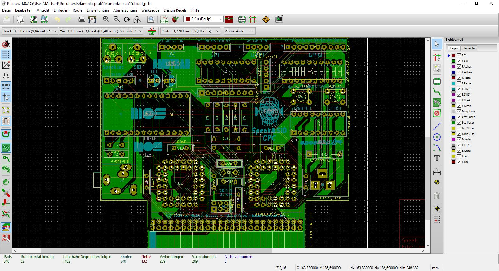

# Speak & SID
A Speech Synthesizer and SID Soundcard for the Amstrad CPC

More soon. 

Pictures:

  
  

YouTube videos: 

- [Second SID Player Demo - Line Out Recording and LED Lightshow](https://youtu.be/FXDS3pdf-w8) 
- [First PCB Version \& SID Player Demo](https://youtu.be/xVo5ycUuM5Q)
- [Breadboard Prototype - First SID BASIC Test](https://youtu.be/dJlccupSALY) 
- [Breadboard Prototype - Amstrad SSA-1 Emulation Test](https://youtu.be/zLsgOHT1fmA)

